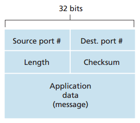

## C++ 部分

### 基础问题
1. 静态成员变量是必须在类的内部声明，在类的外部初始化.
2. 静态成员函数只能访问类内的静态数据，不能访问非静态数据.
3. 静态成员函数内无法使用this指针.
4. 静态成员变量在每一个类中只有一个备份，所有声明的对象共享一个备份.

5. 常量成员变量只能通过构造函数的初始化列表进行初始化，且在其初始化后不能修改。

6. const修饰的成员函数表示其中不能修改成员变量

7. const 修饰的对象表示对象是一个常量，且只能调用const 修饰的成员函数。

    例如:
    ``` c++
        // example 1.0
        // class中const 成员变量和成员函数 
        class C{
        public:
            C(int n, char c):mNum(n), mChar(c){}
            ~C(){}
            int getNum() const{ return mNum; }
            int getChar() const{ return mChar; }
            int setNum( int n){ mNum = n; }
            int setChar(char c){ mChar = c; }
        private:
            const int mNum
            char mChar
        };
        
        // 一般对象
        C a( 100, 'A');

        a.getNum(); // 成功
        a.getChar(); // 成功
        a.setNum(200); // 失败
        a.setChar('B'); // 成功

        // const 对象
        const C b(300, 'B');
        b.getChar(); // 成功
        b.getNum(); // 成功
        b.setChar('A'); //失败
        b.setNum(400); //失败
    ```
8. sizeof 问题： 一个空类的size是 1，因为默认会分配1 byte的内存； 一个包含虚函数的类 的size 为4，因为会为其分配一个指向虚函数表的指针。
    例如：
    ```
        // example 1.1
        // sizeof 知识点
        class C{};
        C c;
        sizeof(c); // size 为 1

        class C1{
        public:
            vitrual void f(){};
        };
        C1 c1;s
        sizeof(c1); // size 为 4
    ```
9. const 和define之间的区别是什么？
const 是常量标识符，define是宏定义标识符，const常量在编译过程中会进行类型检查，而define不会。

10. 重载和重写的区别是什么？什么时候用重载什么时候用重写？
重载是同一个命名空间内相同的函数名称，不同返回值、输入，重写是在子类继承父类后重新实现了父类中的成员函数。
当功能相同但输入或输出类型不同时用重载，子类继承父类的后需要一些特殊实现时用重写。

ps: 重载的形式参数（指参数的个数、类型或者顺序）必须不同。您不能仅通过返回类型的不同来重载函数。

11. 地址&和指针*的区别？
&作为类型传参的时候会判断空指针，比较安全一些

12. C++ 11 的特性？

### 网络编程问题
Q1: epoll和select的区别？
A1: http://note.youdao.com/noteshare?id=a1e5a42b47d3c5c5685e94757efb0d1e&sub=WEBedfa9ed205d0e5c650a1cf2aebe0fd9b

Q2: epoll的边缘触发的应用？


***

## Golang 部分

### 基础问题

Q1: go语言有哪些特性？

A1: Golang支持一级公民函数、包系统、垃圾回收、词法作用域、chain; 为了更好的去支持并发(concurrency)，吸收和继承了CSP( Communicating Sequential Processes, or CSP,通信顺序进程.)系统的优点[1]

ps: 词法作用域，也叫静态作用域，它的作用域是指在词法分析阶段就确定了，不会改变。
ps: 支持一级公民函数的语言可以将函数赋值给变量，也可以将函数作为其他函数的参数或返回值
ps: CSP是一种形式语言，仅用于描述并发性的基本概念。在CSP中程序就是一组无共享状态进程的并行组合，进程间的通信和同步由channel完成

Q2: go 与 C++的区别？ 

A2: Golang 中不支持隐式数据类型强制转换、运算符重载、异常、泛型、宏定义、形参默认值、析构和构造函数、线程局部存储; 支持第一类对象 channel、协程。

Q3: go 协程的特点？

A3: http://note.youdao.com/noteshare?id=b77ab70be99dd454e3c4db4218610521&sub=WEBdb7711018231663e4d4c63bddeaf8993

Q4: context的用途?
A4: https://www.cnblogs.com/cnblogs-wangzhipeng/p/9118507.html

Q5：channel的作用和特性
A5: 作用：channel 是用于 一个goroutine向另一个goroutine 发送特定值的通信机制，每一个channel都有自己具体的元素类型。

特性：通道在创建时可以设定缓存空间，在作为参数调用时允许指定传入方向（接收、发送）。

Q5.1 channel 的类型?

Q6: Go语言中的闭包
A6: 闭包是可以包含自由(未绑定到特定对象)变量的代码块,这些变量不在这个代码块内或者任何全局上下文中定义,而是在定义代码块的环境中定义。要执行的代码块(由于自由变量包含在代码块中,所以这些自由变量以及它们引用的对象没有被释放)为自由变量提供绑定的计算环境(作用域)。

闭包的价值在于可以作为函数对象或者匿名函数,对于类型系统而言,这意味着不仅要表示数据还要表示代码。将函数作为第一级对象,就是说这些函数可以存储到变量中作为参数传递给其他函数,最重要的是能够被函数动态创建和返回。

Q7: goroutine的调度过程？它是在用户态还是内核态？ 

Q8: goroutine 数据同步的方法？


### 网络编程

Q1: grpc 协议的剖析？grpc通讯中grpcserver是如何管理链接的？

A1: http://note.youdao.com/noteshare?id=0fe18c0404b8a536367e2b55b6174837&sub=WEBb887ca04fcb01eb224a6ebc2df754be8

Q2: grpc 


***

## 计算机网络

### 网络七层协议（从上至下）

1. 应用层

2. 表示层

3. 会话层

4. 传输层

5. 网络层

6. 数据链路层

7. 物理层

### 常见的网络协议

+ IPSec(Internet Protocol Security)是一种开放标准的框架结构，通过使用加密的安全服务以确保在Internet进行安全通信。

+ PGP(Pretty Good Privacy, 完美隐私)是一个基于RSA的邮件加密系统。

+ SET(Secure Electronic Transaction, 安全电子交易)是一种互联网安全交易规范，主要是解决信用卡电子付款的其安全保障性问题。

+ ICMP(Internet control message protocol): 控制报文协议

### TCP/IP

四次挥手的过程：https://www.cnblogs.com/cnblogs-wangzhipeng/p/10162026.html

### UDP(User Datagram Protocol)
一种位于传输层的无连接网络协议，它不能保证数据包被发送到目的地址，主要用于实时少量的数据传输，如视频、直播。

UDP数据报文结构要比TCP的更加简单，所以它的网络开销更小，其报文结构如下：


其报文的头部总计只有8bytes，而TCP至少有20 bytes。

### http/https

http协议介绍
超文本传输协议，位于七层网络模型中的第七层--应用层，作为一种在web系统中常用的协议而闻名，但其应用场景并不仅仅局限于网站通讯。它基于的是tcp/ip协议，一个http请求结构如下：

    <Method><url><version>
    <headers>
    <entity-body>

示例如下：

    GET / HTTP/1.1
    Host: 127.0.0.1:8082
    Connection: keep-alive
    Upgrade-Insecure-Requests: 1
    User-Agent: Mozilla/5.0 (Windows NT 10.0; Win64; x64) AppleWebKit/537.36 (KHTML, like Gecko) Chrome/71.0.3578.98 Safari/537.36
    Accept: text/html,application/xhtml+xml,application/xml;q=0.9,image/webp,image/apng,*/*;q=0.8
    Accept-Encoding: gzip, deflate, br
    Accept-Language: zh-CN,zh;q=0.9

http 主要包含以下八种Method：

    + GET
    + HEADER
    + POST
    + DELETE
    + PUT
    + TRACE
    + CONNECT
    + OPTIONS

其中最基本的四个方法：POST、DELETE、PUT、GET，分别对应增删改查。

GET 可提交的数据量受到URL长度的限制，HTTP 协议规范没有对 URL 长度进行限制。这个限制是特定的浏览器及服务器对它的限制。
理论上讲，POST 是没有大小限制的，HTTP 协议规范也没有进行大小限制，出于安全考虑，服务器软件在实现时会做一定限制。
参考上面的报文示例，可以发现 GET 和 POST 数据内容是一模一样的，只是位置不同，一个在URL里，一个在 HTTP 包的包体里。

+ POST: http协议中规定，POST方法传输数据的时候是一定要放在主体中的，当并未限制主体中数据的编码格式。具体的编码格式可以由client和server端之间协商，可以在content-type中标识编码的格式：

    application/x-www-form-urlencoded：最常用的POST数据提交格式，浏览器自带的<form>表单,如果不设置encyte属性，那么最终就会由application/x-www-form-urlencoded格式提交。
    multipart/form-data：常见的POST数据提交方式，我们使用表单提交文件的时候必须让<form>表单的enctype等于multipart/form-data。
    以上两种都为浏览器原生支持的编码格式，原生的Form表单中支持这两种方式（通过<form>元素的enctype属性指定，默认为application/x-www-form-urlencode, enctype还支持text/plain）.
    除此以外，现在越来越多的数据编码格式出现，出现越来越多的编码格式如：
        application/json, text/xml, application/x-protobuf
    只要服务器可以根据Content-type 和Content-Encoding 正确解析即可。

示例如下：

    POST /transfer HTTP/1.1
    Host: 127.0.0.1:8082
    Connection: keep-alive
    Content-Length: 70
    Cache-Control: max-age=0
    Origin: http://127.0.0.1:8082
    Upgrade-Insecure-Requests: 1
    Content-Type: application/x-www-form-urlencoded
    User-Agent: Mozilla/5.0 (Windows NT 10.0; Win64; x64) AppleWebKit/537.36 (KHTML, like Gecko) Chrome/71.0.3578.98 Safari/537.36
    Accept: text/html,application/xhtml+xml,application/xml;q=0.9,image/webp,image/apng,*/*;q=0.8
    Referer: http://127.0.0.1:8082/transfer.html
    Accept-Encoding: gzip, deflate, br
    Accept-Language: zh-CN,zh;q=0.9
    Cookie: SL_G_WPT_TO=zh-CN; SL_GWPT_Show_Hide_tmp=1; SL_wptGlobTipTmp=1; BL_D_PROV=; BL_T_PROV=


**http 响应报文**：

http 响应报文包含三个部分：
+ 状态行
+ 响应头
+ 响应正文

示例如下：

状态行由协议版本、数字形式的状态代码、及相应的状态描述，各元素之间以空格分隔。

常见错误码

    + 100~101:信息提示
    + 200~206:正确
    + 300~305:重定向， 301 Moved Permanently 请求永久重定向， 302 Moved Temporarily 临时重定向,304 Not Modified 文件未修改，可以直接使用缓存的文件 
    + 400~415:客户端错误， 400 Bad Request 客户端请求错误， 401 Unauthorized 未经请求授权（必须与WWW-Authenticate 报头域一起使用），403 Forbidden 服务器收到请求但是拒绝服务，404 not Found 请求的资源不存在（比如url输入错误）
    + 500~505:服务端错误
    + 500: Internal Server error 服务器内部错误
    + 501: 未实现
    + 503: Server Unavailable 服务不可用
    + 504:网关超时
    + 505：http版本不支持

http 响应报文：
    <状态码><响应头><响应载体>

示例如下：

    HTTP/1.1 200 OK
    Accept-Ranges: bytes
    Content-Length: 4759
    Content-Type: text/html; charset=utf-8
    Last-Modified: Sun, 16 Sep 2018 07:05:16 GMT
    Date: Thu, 10 Jan 2019 05:54:51 GMT   
    <html></html>     

**http 头部属性**：


###Q&A
Q1：tcp握手的过程，发了几个报文：
A1: 总计发送三个报文

Q2: linux中查看当前tcp数量的命令的命令：
A2: ss命令可以查看当前tcp的链接数和链接状态，tcpdump 命令可以用来监测 网络包流量，strace 可以用来监测内存、cpu等使用情况

Q3: 客户端频繁连接造成大量 TIME_WAIT状态的连接，怎么解决？
A3: 复用TCP连接减少建立TCP连接的频率，同时可以采用心跳机制来减少不活跃连接。

Q4: 如何避免粘包和串包的问题？
A4:  

Q5: ssl 连接过程，如何避免女巫攻击

A5: https://www.jianshu.com/p/7158568e4867

Q6: ech 密钥协商过程


## 服务开发

###服务注册与发现

http://jm.taobao.org/2018/06/26/%E8%81%8A%E8%81%8A%E5%BE%AE%E6%9C%8D%E5%8A%A1%E7%9A%84%E6%9C%8D%E5%8A%A1%E6%B3%A8%E5%86%8C%E4%B8%8E%E5%8F%91%E7%8E%B0/

### CAP理论

## 区块链部分
### 平台

Ethereum、Fabric、EOS

### 共识协议

理解各类主流的共识算法，包括不限于PoW, PoR，PoS，DPoS，PBFT，Paxos，Raft等；

## 数据库

Q1. Leveldb的实现和原理

常用的有：SQL、MySQL、Redis、MongoDB等

掌握web框架、Linux系统调优、高并发场景

Q2. Mysql 搜索引擎的原理

Q3. redis 


## 操作系统

Q1. 什么是僵尸进程、孤儿进程？
僵尸进程：处于僵尸状态的进程即将结束运行，该进程占用的绝大多数资源也都被回收，不过还有一些信息没有删除，比如退出码以及一些统计信息。考虑到父进程可能需要它，此时进程的主题已经被删除了只留下一个空壳，所以此状态称之为僵尸状态。Fork创建的子进程可以通过wait（）或waitpid()获取终止状态（此时进程处于Z状态）。

僵尸进程的危害：虽然僵尸进程的大部分资源都已经被释放，但是它的pid、退出状态、运行时间等还是会被保留，而系统的进程号是有限的（被保存在一个叫Zombie数据结构中）。过多的僵尸进程可能会导致无法为新的进程分配pid而无法创建新的进程。

处理方法：捕捉SIGCHLD信号，并调用waitpid()函数进行处理。

孤儿进程：linux中可以用fork函数创建子进程，当子进程还没有退出，但是父进程已经结束，此时子进程会被init进程收养（pid为1，又称为内核启动进程），成为直接子进程。


参考网址：https://www.cnblogs.com/Anker/p/3271773.html

## 算法

Q1. 25亿个整数找出重复数。

## 工具栈
Q1. 除了rabbitMq, 还熟悉哪些消息队列

## 工作岗位要求

1. 熟悉常见Web开源工具技术栈（包括但不限于HAProxy/Nginx/MySQL/Redis/RabbitMQ/ElasticSearch）
5. 精通网络编程，深入的学习过 TCP/IP 协议簇，熟悉HTTP协议细节。6. 熟悉Docker/Kubernetes工具栈。

腾讯音乐
岗位职责：	1、负责QQ音乐后台开发工作；2、负责中大型项目的后台server软件架构和整体框架设计；3、参与相关产品需求讨论与产品系统架构的设计和优化工作。岗位要求：	1、精通Linux平台下的Golang开发，精通TCP/IP协议，熟悉网络编程，熟悉多进程/多线程编程，熟悉Unix/Linux下常用架构设计方法；2、熟悉Mysql，Redis等数据库管理、开发，SQL调优；3、具备良好的分析解决问题能力，能独立承担任务和有系统进度把控能力；4、责任心强，良好的对外沟通和团队协作能力，主动，好学；5、有互联网海量分布式系统设计和开发经验优先；6、具备流媒体CDN成熟优化经验者优先。


工作职责：负责腾讯音乐相关产品（QQ音乐/全民K歌等产品）后台工作；负责中大型项目的后台server软件架构和整体框架设计；负责提出海量服务的解决方案，寻找高并发高负载服务应对策略；负责Linux下面的C/C++系统以及数据库应用的设计和开发，要求开发的系统具有高性能和高可靠；参与相关产品需求讨论与产品系统架构的设计和优化工作。工作要求：本科及以上学历，至少2年以上相关开发经验；'掌握C/C++/Go等编程语言中的一种或几种，并有实际的项目开发经验，熟悉Linux下的网络编程及常用的系统编程知识，熟悉互联网应用协议；了解并使用过KV存储，如Redis，了解MySQL及其相关开发，具备一定的数据分析能力；具有良好的分析解决问题能力，能独立承担开发任务，有一定的项目进度把控能力；责任心强，良好的沟通和团队协作能力，主动，好学；拥有扎实和体系完备的计算机专业知识，有互联网高并发、高性能、分布式系统设计和开发经验者优先；有流媒体、音视频处理经验、熟悉ffmpeg，可加分但不做强求；掌握一定推荐系统知识者，可加分但不做强求

腾讯手Q
 工作职责：负责手Q附近业务后台设计、实现与维护；负责手Q附近后台基础组件相关开发和维护；负责手Q附近海量后台框架的设计、开发和维护。工作要求：工作要求：本科及以上学历，计算机相关专业；热爱编程，精通Unix/Linux下C/C++/Java/Go其中至少一门语言，且有3年以上开发经验， 熟悉常用的数据结构、算法设计；熟悉Unix/Linux操作系统原理、常用工具， 熟悉Mysql等数据库管理、开发,SQL调优；全面的软件知识结构(操作系统、软件工程、设计模式、数据结构、数据库系统、网络安全)；对海量、高性能、分布式系统开发/性能优化有经验者优先；

Shopee
Role and Responsibilities职责：1.负责信贷业务系统架构设计与开发，例如账户系统，风控系统，后台管理系统等；2.解决项目中遇到的问题，进行系统性能优化，安全加固，保证平台安全、稳定、快速运行；3.根据需求参与平台项目开发和维护，参与制定前后端业务流程，接口协议，文档输出等；4.负责建设信贷业务的大数据平台，包括数据采集、传输、存储、计算、可视化等底层能力；5.负责海量数据的建模、处理、分析和挖掘工作；各类统计，完成日常数据分析查询需求；数据仓库建设；6.负责风控模型基础数据及用户画像相关体系建设；Qualifications and Education Requirements本科以上计算机相关专业Preferred Skills1.大学本科以上学历，2年以上工作经验，熟悉golang语言，基础扎实，1年以上golang开发工作经验，有完整的项目经验 ；同时熟练掌握C++/Python任意一门语言者优先;2. 熟悉Golang协程，精通channel和锁，对高并发、高可用架构系统有正确、深刻的理解，有分布式服务设计或开发经验者优先；3.有Web开发经验，对RESTful概念有清晰的理解，并至少有一次API Server开发项目中运用到；4.熟悉xml/json/protobuf等至少任意一种网络通信技术和数据交换格式；5.良好的算法基础和清晰的编程思路；熟悉tcp，ip，http等网络协议；6.熟悉MySQL，熟悉数据库原理和常用性能优化技术，同时熟悉其他数据库（如Redis、MongoDB等）者优先； 7.熟悉微服务docker,k8s者优先；熟悉HDFS/HBase/Hive/Storm/Spark/Spark Streaming/Kafka/flume 等相关技术；有多个或多年大数据项目的实施经验优先；8.工作积极主动，态度踏实认真，有较强的职业素养和工作操守；具有良好的团队合作精神，有较强的开发能力和灵活性；9.对技术有激情，喜欢钻研，能快速接受和掌握新技术，学习能力和工作责任心强，良好的沟通表达能力和团队协作能力；

腾讯
有扎实的计算机理论基础；至少熟练使用PHP、JAVA、GOLANG开发语言中的1-2种具备海量实时数据处理平台建设经验优先；熟悉常用NoSQL存储中间件，如Memcached、redis、mongodb等；微服务应用架构设计，并具备大型项目实践经验，有微服务应用开发框架设计开发经验者优先：熟悉ElasticSearch/HADOOP/SPARK/KAFKA/DRUID等组件，有相关项目经验优先；掌握Web端技术，熟练使用HTML、Javascript、CSS等，熟悉JQuery、Bootstrap等流行前端框架优先。

TEG15-区块链后台开发工程师（深圳）
职位描述：

工作职责：
负责区块链产品TBaaS的底层架构设计和研发工作；
研究区块链的协议，运行机制和底层实现。
任职要求：
对计算机网络、分布式系统、密码学、网络安全等有深刻理解；
精通C/C++/Java/Go中的一种或多种语言；
至少熟悉一种区块链开源项目，了解底层架构及原理，有实际开发经验优先；
理解区块链各类主流共识算法，如PBFT、Paxos、Raft等。 

## 参考网址
+ 常见的面试基础知识 https://hit-alibaba.github.io/interview/basic/network/TCP.html
+ go web开发中的cookie 和session https://colobu.com/2018/09/28/cookie-and-session-in-go/